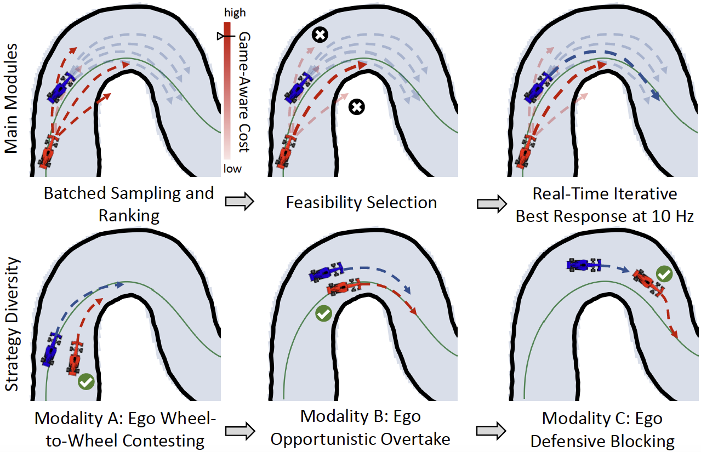

# 🏎️ vs. 🏎️ SGTP: Sampling-based Game-Theoretic Planning for Real-Time Multi-Vehicle Autonomous Racing

<div align="center">
  
  
  
  
</div>

> **TL;DR**: SGTP enables real-time multi-vehicle planning and generates diverse interactive racing behaviors, including defensive blocking, wheel-to-wheel racing, and opportunistic overtaking, while supporting smooth and safe transitions among them. 

This repository provides an implementation and visualization toolkit for the **Sampling-based Game-Theoretic Planning (SGTP) framework** introduced in the paper, “[SGTP: Sampling-based Game-Theoretic Planning for Real-Time Multi-Vehicle Autonomous Racing](https://arxiv.org/abs/2607.25388v1).” It also includes implementations of several baseline methods, forming a benchmark suite for evaluating multi-vehicle interaction planning algorithms. The benchmark uses a diverse collection of racetrack maps from [MapZoo](https://github.com/zhouhengli/MapZoo).

<table>
  <tr>
    <td align="center" width="50%">
      
		<br/>
      	<b>(a)</b> Teaser
    </td>
    <td align="center" width="50%">
      
		<br/>
      	<b>(b)</b> 10 Vehicles
    </td>
  </tr>  
  <tr>
    <td align="center" width="50%">
      
				<br/>
      	<b>(c)</b> 9 Vehicles
    </td>
    <td align="center" width="50%">
      
		<br/>
      	<b>(d)</b> 8 Vehicles
    </td>
  </tr>
</table>


## 🪄 Quickstart

The project uses a Conda environment and has been tested on systems equipped with NVIDIA GeForce RTX 4060 and RTX 3090 GPUs, as well as on a MacBook Air powered by an Apple M3 chip. A CUDA-capable NVIDIA GPU is **strongly recommended** for achieving the best performance and reproducing the reported real-time planning results.

This repository includes [MapZoo](https://github.com/zhouhengli/MapZoo) as a Git submodule, providing a diverse collection of racetrack maps. Clone the repository together with all required submodules:

```bash
git clone --recurse-submodules https://github.com/zhouhengli/SGTP-Racer.git SGTP-Racer
cd SGTP-Racer
```

Because this repository includes pretrained checkpoints, cloning via SSH is recommended for a more reliable transfer: 

```bash
git clone --recurse-submodules git@github.com:zhouhengli/SGTP-Racer.git SGTP-Racer
```

## 🛠️ Configure

**[1/3] Create and activate a Conda environment:** Create an isolated Conda environment with Python 3.9, then activate it:

```bash
conda create -n sgtp-racer python=3.9
conda activate sgtp-racer
```

**[2/3] Install the dependencies:** Install the required Python packages, followed by the SGTP project and the F1TENTH Gym environment in editable mode:

```
pip install -r requirements.txt
pip install -e .
cd f1tenth_gym
pip install -e .
cd ..
```

**[3/3] Run a single trial:** Run `run_multi_method.py` with the following example configuration:

```bash
python players/run_multi_method.py --sim_duration=1 --num_agents=3 --interval_idx=20 --ego_idx=1100
```

This command launches a `1`-second race with `3` vehicles. The gaps between vehicles are determined by `interval_idx`, while `ego_idx` specifies the ego vehicle's starting index. Video is saved in `results/`.

## 📖 Overview

This repository provides two complementary modes for running competitive racing experiments. Configuration files for individual methods are located in `players/config`.

**[1/2] Single-run experiment**: Use `run_multi_method.py` to run a single trial on a single map.

This mode allows users to manually **specify the ego vehicle’s starting index**, making it particularly useful for debugging and qualitative analysis. By default, a video recording is automatically generated and saved for each experiment.

**[2/2] Batched evaluation**: Use `run_batched_competitive.py` for large-scale quantitative evaluation. 

This mode runs **multiple trials** on each evaluation map and samples the ego vehicle's starting indices uniformly along the track. The map split is defined in `config/data_split_final.yaml`: Maps listed under `test` are used for evaluation; the remaining maps in `train` are used for learning-based methods. During batched evaluation, experiment metadata is saved first by default. Videos can then be generated from these metadata files by the file `batch_render_episode_videos.py`.

**🛎️ Important Note**: The competitive racing implementation shared by both modes is located in: `players/planner/competitive_planner.py`. Therefore, the two scripts should be viewed as different experiment interfaces built on top of the same competitive planner.

## 🚀 Planner Benchmarks

Our baselines comprise a diverse set of racing planners, including learning-based, sampling-based, optimization-based, and game-theoretic approaches.

| Method                                | Category                              | Reference                                                 |
| ------------------------------------- | ------------------------------------- | --------------------------------------------------------- |
| SGTP (Ours)                           | Proposed method                       | This repository                                           |
| Lattice Planner                       | Search-based                          | https://github.com/michigan-traffic-lab/End2Race          |
| Race Stack with Spliner               | Finite-State-Machine                  | https://github.com/ForzaETH/race_stack                    |
| End2Race                              | End-to-end learning                   | https://github.com/michigan-traffic-lab/End2Race          |
| Conditional Flow-Matching (CFM)       | Generative learning                   | https://github.com/DiffusionAD/Flow-Planner.git           |
| Standard MPPI                         | Sampling-based predictive control     | https://github.com/kohonda/mppi_playground                |
| Biased-MPPI                           | Sampling-based predictive control     | https://github.com/tud-amr/biased-mppi                    |
| EVO-MPCC                              | Optimization-based predictive control | https://github.com/zhouhengli/EVO-MPCC                    |
| Iterative Best Response with EVO-MPCC | Game-Theoretic planning               | https://github.com/WeiqiLyu/Game-Theoretic-Motion-Planner |

### Single-run experiment

This section describes how to configure and run SGTP and the baseline racing planners in single-run experiments. Unless otherwise specified, planner settings should be configured in:

```text
players/config/run_config.yaml
```

The following subsections describe how to configure each planner. Once the configuration is complete, run the command below to start the selected planner. The resulting video will be saved to `results/`.

All examples use a simulation duration of 15 seconds with three agents with default `interval_idx=20` and `ego_idx=1100`:

```bash
python players/run_multi_method.py --sim_duration=15 --num_agents=3
```

------

#### SGTP (Proposed Method)

SGTP uses GPU-accelerated sampling with iterative best response and feasibility-based trajectory selection. In `players/config/run_config.yaml`, set:

```yaml
planner_family: "mppi"
interaction_mode: "ibr"
```

In `players/planner/planner_generators.py`, set:

```python
MPPI_POST_SELECT = True  # Enable feasibility-based trajectory selection.
USE_OPP_PRED = True      # Enable opponent prediction for the game-aware cost.
```

In `players/config/game_cost_config.yaml`, set:

```yaml
game_cost_weight: 60.0
```

------

#### Lattice Planner

In `players/config/run_config.yaml`, set:

```yaml
planner_family: "lattice_planner"
interaction_mode: "nonreactive"
```

------

#### Race Stack with Spliner

In `players/config/run_config.yaml`, set:

```yaml
planner_family: "spliner"
interaction_mode: "nonreactive"
```

------

#### End2Race

End2Race can be evaluated directly using a pretrained model at `players/planner/End2Race/pretrained`. To run the planner, configure the following settings in `players/config/run_config.yaml`:  

```yaml
planner_family: "end2race"
interaction_mode: "nonreactive"
end2race: false
```

When evaluating a newly trained model, update the model checkpoint path in:

```text
players/planner/End2Race/end2race_generator.py
```

Ensure that the configured path points to the newly trained model checkpoint.

End2Race requires an offline data-collection and training pipeline when training a model from scratch.

**[1/3] Enable data collection:** In `players/config/run_config.yaml`, enable the End2Race data-collection mode:

```yaml
end2race: true
```

> Data collection may take approximately 10 hours, depending on the available hardware and system performance.

**[2/3] Collect the training data:** To run data collection in the background on a server, use:

```bash
nohup bash players/planner/End2Race/collect.sh > collect.log 2>&1 &
```

**[3/3] Train the model:** After data collection is complete, launch model training:

```bash
nohup python players/planner/End2Race/train.py \
  --data_path <dataset_dir>/success \
  --model_path pretrained.pth \
  --hidden_scale 4 \
  --mask_prob 0.1 \
  --batch_size 16 \
  > train.log 2>&1 &
```

Replace `<dataset_dir>` with the directory containing the collected dataset.

After training, update the model checkpoint path in `players/planner/End2Race/end2race_generator.py` and set the data-collection flag back to:

```yaml
end2race: false
```

------

#### Conditional Flow-Matching Planner

In `players/config/run_config.yaml`, set:

```yaml
planner_family: "flow_planner"
interaction_mode: "nonreactive"
```

------

#### Standard MPPI

Standard MPPI uses conventional weighted control aggregation rather than SGTP's feasibility selection. It also does not use predicted opponent trajectories and instead relies on distance-based collision avoidance.

In `players/config/run_config.yaml`, set:

```yaml
planner_family: "mppi"
interaction_mode: "nonreactive"
```

In `players/planner/planner_generators.py`, set:

```python
MPPI_POST_SELECT = False  # Use standard MPPI weighted control aggregation.
USE_OPP_PRED = False      # Disable opponent-trajectory prediction.
```

In `players/config/game_cost_config.yaml`, set:

```yaml
game_cost_weight: 0.0
```

The main distinction between Standard MPPI and SGTP is how the final control is selected:

- **Standard MPPI** computes the control using the conventional weighted sum of sampled controls.
- **SGTP** performs feasibility selection over the candidate trajectories.

------

#### Biased MPPI

Biased MPPI uses the same MPPI configuration as Standard MPPI, but enables ancillary trajectory biasing for both the ego vehicle and opponent vehicles.

In `players/config/run_config.yaml`, set:

```yaml
planner_family: "mppi"
interaction_mode: "nonreactive"
```

In `players/planner/planner_generators.py`, set:

```python
MPPI_POST_SELECT = False  # Use standard MPPI weighted control aggregation.
USE_OPP_PRED = False      # Disable opponent-trajectory prediction.
```

In `players/config/game_cost_config.yaml`, set:

```yaml
game_cost_weight: 0.0
```

To enable ancillary biasing, provide the corresponding bias-mode options when running the script:

```bash
python players/run_multi_method.py \
  --sim_duration=15 \
  --num_agents=3 \
  --mppi_bias_mode_ego="ancillary" \
  --mppi_bias_mode_opp="ancillary"
```

------

#### EVO-MPCC

To run EVO-MPCC without iterative best response, set the following in `players/config/run_config.yaml`:

```yaml
planner_family: "mpc"
interaction_mode: "nonreactive"
```

------

#### EVO-MPCC with Iterative Best Response

To run the EVO-MPCC formulation with iterative best response, set the following in `players/config/run_config.yaml`:

```yaml
planner_family: "mpc"
interaction_mode: "ibr"
```

### Batched evaluation

For batched evaluation, first configure `players/config/eval_config.yaml` and select the planner using the same settings described in the previous section. Then run:

```bash
nohup python players/run_batched_competitive.py --sim-duration=15 --num-start-points-per-map=6 > out.log 2>&1 &
```

Evaluation results are saved under `results/eval/<method>_raw_eval_<timestamp>/`. Batched evaluation does not save videos by default. To render videos from the saved experiment metadata, run the following script:

```bash
python players/batch_render_episode_videos.py   \
	--input-dir results/eval/mppi_ibr_raw_eval_20260805_120356   \
	--num-workers 12   \
	--overwrite
```

The generated videos will be saved in `results/all_episode_videos`.

## 💻 Advanced Configuration

[TBA]

### ✏️ Tuning Competitive Aggressiveness

[TBA]


## 🤝 Future Research and Collaboration

Contributions, extensions, and research collaborations built upon this project are highly welcome!

One promising direction is to integrate the proposed method into the **CARLA** simulator, construct competitive interaction scenarios, and collect data for training a **WAM model** that captures competitive behaviors. Building on this setup, the proposed method could also serve as an **opponent** for training reinforcement learning agents, as well as a challenging interactive counterpart for systematically evaluating the performance, robustness, and generalization capabilities of other **ego methods**.

## ⭐ Project Highlights

- ✔️ State-of-the-art competitive racing planner with real-time planning capabilities
- ✔️ Most comprehensive open-source multi-car racing benchmark with diverse and complex racetracks.
- ✔️ Fully reproducible simulation on F1TENTH GYM
- ✔️ Open-source implementation accompanying publications
- ✔️ Actively maintained and extensible for future research

Last but not least, a ⭐ would be greatly appreciated and would serve as strong encouragement for my continued open-source research efforts : )

## 🤗 Acknowledgments

Many thanks to the excellent open-source repositories listed below:

- [TBA]

Please contact [Zhouheng Li](https://zhouhengli.github.io) if you have any questions or suggestions. If you encounter any issues or have questions during deployment, feel free to open an issue or submit a pull request—contributions and feedback are very welcome.

## 📑 Citations

If you find this project useful for your research, please consider citing the following papers :)

```
@misc{li2026sgtpsamplingbasedgametheoreticplanning,
      title={SGTP: Sampling-based Game-Theoretic Planning for Real-Time Multi-Vehicle Autonomous Racing}, 
      author={Zhouheng Li and Fangguo Zhao and Mattia Piccinini and Baha Zarrouki and Yuan Gao and Zitong Shan and Johannes Betz and Chen Lv and Lei Xie},
      year={2026},
      eprint={2607.25388},
      archivePrefix={arXiv},
      url={https://arxiv.org/abs/2607.25388}, 
}
```

```
@article{Li2025EVOMPCC,
  title   = {EVO-MPCC: Enhanced Velocity Optimization with Learning-Based Auto-Tuning for Real-Time Vehicle Trajectory Planning},
  author  = {Li, Zhouheng and Zhou, Bei and Piccinini, Mattia and Hu, Cheng and Zarrouki, Baha and Mangharam, Rahul and Xie, Lei},
  year    = {2025},
  doi     = {10.2139/ssrn.6127037},
  url     = {https://ssrn.com/abstract=6127037},
}
```
